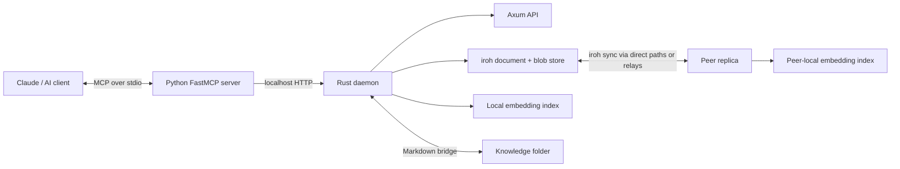

# Learnings Pool

Learnings Pool is a local-first knowledge-sharing system for AI agents. An agent can save a
project insight on one machine, synchronize the canonical record through an iroh document, and
retrieve it from another peer through Model Context Protocol (MCP) tools.

The project combines an asynchronous Rust daemon, a thin Python MCP server, content-addressed
records, peer-to-peer replication, a bidirectional Markdown bridge, and evaluated lexical and
semantic retrieval.

## What it does

- Exposes five MCP tools for sharing, searching, retrieving, and inspecting the local replica.
- Stores immutable-style learning records under BLAKE3 content IDs.
- Replicates canonical learning JSON between paired iroh document peers.
- Mirrors learnings to and from a non-recursive folder of Markdown files.
- Provides substring, ranked lexical, semantic, and hybrid retrieval modes.
- Builds embeddings independently on each peer instead of synchronizing model-specific vectors.
- Evaluates retrieval with a versioned 32-query dataset.

## Architecture



The Python process is an agent-facing adapter. It does not own storage or iroh networking: it
translates MCP tool calls into requests to the Rust daemon's `127.0.0.1` HTTP API. The long-running
daemon owns the persistent iroh identity, replicated document, blob store, retrieval projection,
filesystem bridge, and HTTP server.

Only canonical learning records synchronize. Embeddings are derived locally from each peer's
replica and can be rebuilt without changing shared state. iroh may use public relay infrastructure
for reachability, but Learnings Pool has no centralized application database or knowledge server.

## Data model

A learning contains:

```json
{
  "id": "blake3(title + newline + body)",
  "title": "Retry transient HTTP failures",
  "body": "Retry HTTP 429 and 503 with exponential backoff and jitter.",
  "tags": ["http", "reliability"],
  "author": "machine-a",
  "created": 1786880000,
  "is_delete": false
}
```

The 64 KiB JSON size cap is enforced by the Rust store. The content ID covers the title and body;
tags, author, and timestamp are metadata rather than part of the identity.

## MCP tools

| Tool | Purpose |
|---|---|
| `share_learning` | Add a learning to the local replicated document |
| `search_learnings` | Run the original case-insensitive substring search |
| `retrieve_context` | Return bounded, ranked lexical/semantic/hybrid excerpts with scores |
| `get_learning` | Fetch a complete learning by exact content ID |
| `sync_status` | Report local learning count and configured sync-peer count |

`retrieve_context` supports `top_k`, required tags, an approximate context-token budget, retrieval
mode, and a minimum score. An AI client can retrieve compact candidates and call `get_learning`
only for records it needs to expand.

## Retrieval

The original `/learnings?query=` route performs a linear case-insensitive substring scan across
title, body, and tags. The ranked `/retrieve` route supports:

- `lexical`: phrase and distinct-term coverage scoring;
- `semantic`: cosine similarity over local FastEmbed sentence embeddings;
- `hybrid`: a weighted combination of lexical and semantic scores.

Semantic inference uses the quantized `all-MiniLM-L6-v2` model through FastEmbed/ONNX. The model
downloads on first semantic use and is cached locally. CPU-heavy model work runs on a blocking
Tokio worker rather than an async executor thread.

### Evaluation results

The first local run of `evaluation/retrieval-v1.json` produced:

| Mode | Recall@5 | MRR | No-result accuracy |
|---|---:|---:|---:|
| Substring baseline | 0.0690 | 0.0690 | 1.0000 |
| Ranked lexical | 0.2069 | 0.2069 | 1.0000 |
| Semantic | **0.8621** | **0.8448** | 1.0000 |
| Hybrid | 0.5517 | 0.5517 | 1.0000 |

These are development-set results, not a claim of general retrieval quality. In particular, the
current fixed hybrid weights are not calibrated: semantic-only retrieval outperformed hybrid on
this dataset. The benchmark makes that limitation measurable and provides a baseline for tuning.

Run it against a local daemon:

```bash
python evaluation/benchmark.py --seed  # insert fixtures and evaluate all modes
python evaluation/benchmark.py         # repeat without rewriting fixtures
```

Run once to warm the model cache before comparing steady-state latency.

## HTTP API

The daemon binds the following API to `127.0.0.1` only:

| Method | Route | Purpose |
|---|---|---|
| `POST` | `/learnings` | Validate and create a learning |
| `GET` | `/learnings?query=` | List or substring-search learnings |
| `GET` | `/learnings/{id}` | Fetch one learning |
| `GET` | `/retrieve` | Run bounded ranked retrieval |
| `GET` | `/status` | Return learning and configured-peer counts |

Example:

```bash
curl 'http://127.0.0.1:7777/retrieve?query=retry+temporary+failures&mode=semantic&top_k=5'
```

## Build and test

### Prerequisites

- Rust and Cargo
- Python 3.10+
- [`uv`](https://docs.astral.sh/uv/) for the MCP environment
- On Windows: MSVC C++ x64/x86 Build Tools and a Windows SDK

### Rust tests

```bash
cd daemon
cargo test --locked
```

If the repository is inside a OneDrive-managed folder on Windows, use a build directory outside
OneDrive:

```powershell
$env:CARGO_TARGET_DIR = "$env:LOCALAPPDATA\learnings-pool-target"
cargo test --locked
```

### Start a local notebook

Create a notebook once:

```bash
cd daemon
cargo run -- pair create
```

Treat the printed write ticket as a secret. Anyone holding it can join and write to the document,
and the current application does not implement ticket revocation.

Start the API and synchronization loop:

```bash
cargo run -- serve --api-port 7777
```

Verify it from another terminal:

```bash
curl http://127.0.0.1:7777/status
```

### Connect an MCP client

```bash
uv sync --project ./mcp
claude mcp add learnings --env LEARNINGS_API=http://127.0.0.1:7777 -- \
  uv run --project ./mcp learnings-mcp
```

The checked-in `.mcp.json` provides the equivalent repository-local configuration.

## Pair two machines

Machine A creates a notebook and privately sends its ticket to Machine B. Machine B runs:

```bash
learnings-daemon pair join '<ticket>'
learnings-daemon serve --api-port 7777
```

Machine A must also keep `serve` running. A learning created while another peer is unavailable is
stored locally and can synchronize after the daemons reconnect. See [Pairing](docs/PAIRING.md) for
the Linux systemd setup and knowledge-folder configuration.

## Repository layout

```text
daemon/       Rust daemon, HTTP API, iroh storage/sync, retrieval, and Markdown bridge
mcp/          Python FastMCP adapter
evaluation/   Versioned retrieval fixtures and benchmark harness
scripts/      Linux integration and setup scripts
docs/         Pairing documentation
Plans/        Original design document
systemd/      User-service template
```

## Current limitations

- Hybrid weights and the minimum-score threshold require evaluation-driven calibration.
- The vector projection is in memory and rebuilds after daemon restart.
- Retrieval scans local candidates and is intended for small knowledge pools; there is no ANN
  vector database, pagination, or persistent full-text index.
- `/status` counts configured sync peers, not live network connections.
- The localhost HTTP API has no authentication or authorization.
- Displayed `author` values are caller-supplied and are not cryptographically verified.
- Pairing tickets grant write capability and have no application-level revocation workflow.
- There is no public edit/delete API, provenance schema, conflict-management UI, or structured
  retrieval telemetry yet.

## Verification scripts

The Bash scripts exercise two simulated peers and are intended for Linux/WSL environments:

```bash
./scripts/test-sync.sh
./scripts/test-bridge.sh
./scripts/test-api.sh
./scripts/test-mcp.sh
```

## Design

The original design and rationale are in [Plans/learnings-pool-design.md](Plans/learnings-pool-design.md).
